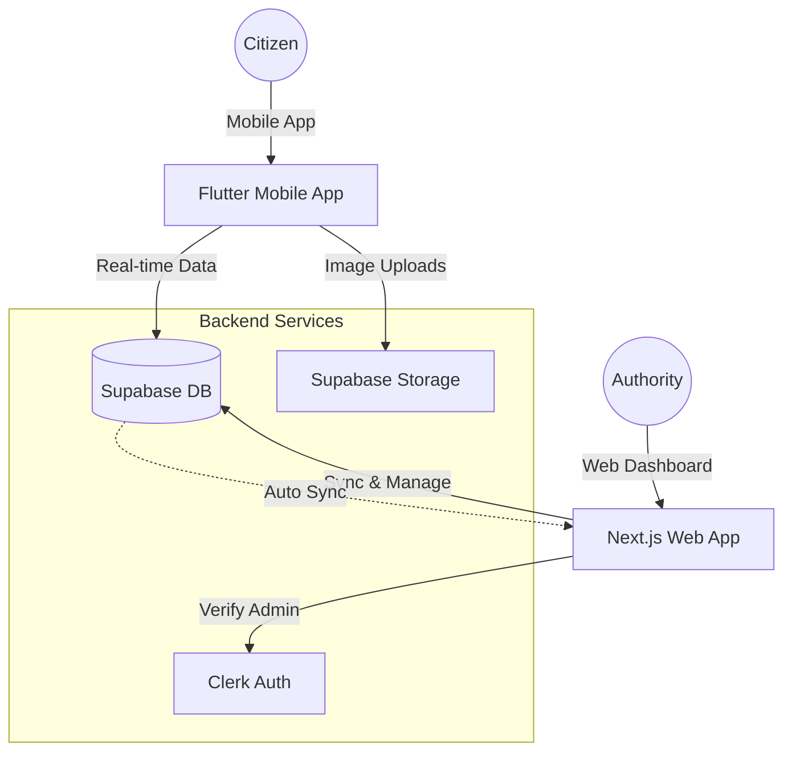

# 🏛️ जनसेतु (JanSetu) - Civic Issue Reporting & Resolution System


## 🌟 Overview

**JanSetu** is a comprehensive, production-ready civic technology platform designed to bridge the gap between citizens and local authorities. By leveraging modern web and mobile technologies, JanSetu empowers communities to report, track, and resolve local issues in real-time, fostering a more transparent and responsive governance ecosystem.

---

## 🚀 Key Features

### 📱 Mobile App (Citizen Interface)
- **Instant Reporting**: Report issues with photos, GPS location, and detailed descriptions.
- **Community Voting**: Upvote/downvote issues to help authorities prioritize critical tasks.
- **Real-time Tracking**: Get push notifications and status updates as your reported issues move from "Pending" to "Resolved".
- **Map View**: Visualize all reported issues in your neighborhood on an interactive map.
- **Offline Support**: Draft reports even when offline and sync them once connected.

### 💻 Web Dashboard (Admin & Analytics)
- **Issue Management**: Comprehensive dashboard for authorities to manage, assign, and update issue statuses.
- **User Analytics**: Insights into reporting trends, hot spots, and resolution efficiency.
- **Secure Authentication**: Enterprise-grade security with Clerk integration.
- **Data Synchronization**: Automated real-time sync between web and mobile platforms via Supabase.

---

## 🛠️ Tech Stack

| Component | Technology |
| :--- | :--- |
| **Frontend (Web)** | Next.js 14, TypeScript, Tailwind CSS, shadcn/ui |
| **Mobile App** | Flutter (Dart), Riverpod (State Management) |
| **Backend / BaaS** | Supabase (PostgreSQL, Auth, Storage) |
| **Authentication** | Clerk (Web) & Supabase Auth (Mobile) |
| **Infrastructure** | Vercel (Web), Supabase (Database) |

---

## 📐 System Architecture



---

## 📦 Project Structure

```bash
.
├── civic_issue_app/        # Flutter Mobile Application
├── web_app/                # Next.js Web Application
├── assets/                 # Brand assets and images
└── database_schema.sql     # Unified database schema
```

---

## 🚦 Getting Started

### 1. Prerequisites
- **Web**: Node.js 18+, npm/yarn.
- **Mobile**: Flutter SDK 3.0+, Android Studio / Xcode.
- **Cloud**: Supabase account, Clerk account.

### 2. Web App Setup
```bash
cd web_app
npm install
cp .env.example .env.local
# Add your Clerk and Supabase keys
npm run dev
```

### 3. Mobile App Setup
```bash
cd civic_issue_app
flutter pub get
# Update lib/config/app_config.dart with Supabase URL/Key
flutter run
```

---

## 🛡️ Security & Scalability
- **Row Level Security (RLS)**: Fine-grained access control on Supabase tables ensures users only access what they're authorized to.
- **JWT-based Auth**: Secure communication between frontend and backend.
- **Optimized Queries**: Database indexes and optimized RLS policies for high performance.

---

## 🤝 Contributing

We welcome contributions! Please see our [CONTRIBUTING.md](CONTRIBUTING.md) for details on our code of conduct and the process for submitting pull requests.

## 📄 License

This project is licensed under the MIT License - see the [LICENSE](LICENSE) file for details.

---

Built with ❤️ for better governance and community engagement.
